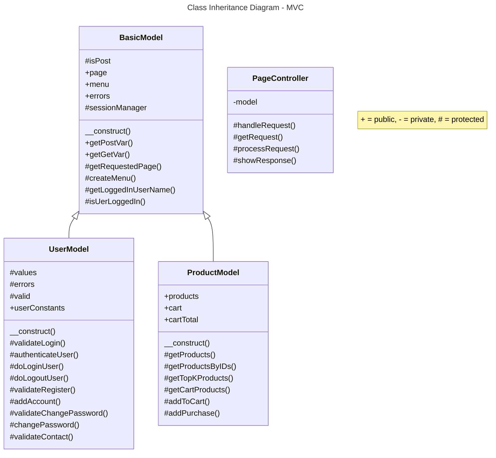

```mermaid
---
title: Class Inheritance Diagram - MVC
---
classDiagram
    note "+ = public, - = private, # = protected"
    %% A <|-- B means that class B inherits from class A %%

    BasicModel <|-- UserModel
    BasicModel <|-- ProductModel

    class PageController {
        -model
        #handleRequest()
        #getRequest()
        #processRequest()
        #showResponse()

    }
    class BasicModel {
        #isPost
        +page
        +menu
        +errors
        #sessionManager
        __construct()
        +getPostVar()
        +getGetVar()
        #getRequestedPage()
        #createMenu()
        #getLoggedInUserName()
        #isUerLoggedIn()
    }

    class UserModel {
        #values
        #errors
        #valid
        +userConstants
        __construct()
        #validateLogin()
        #authenticateUser()
        #doLoginUser()
        #doLogoutUser()
        #validateRegister()
        #addAccount()
        #validateChangePassword()
        #changePassword()
        #validateContact()
    }

    class ProductModel {
        +products
        +cart
        +cartTotal
        __construct()
        #getProducts()
        #getProductsByIDs()
        #getTopKProducts()
        #getCartProducts()
        #addToCart()
        #addPurchase()
    }

```