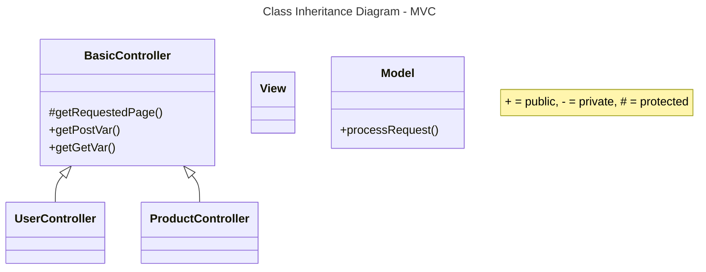

```mermaid
---
title: Class Inheritance Diagram - MVC
---
classDiagram
    note "+ = public, - = private, # = protected"
    %% A <|-- B means that class B inherits from class A %%

    BasicController <|-- UserController
    BasicController <|-- ProductController

    class BasicController {
        #getRequestedPage()
        +getPostVar()
        +getGetVar()
    }

    class UserController {
        
    }

    class ProductController {

    }

    class View {

    }

    class Model {
        +processRequest()
    }

```