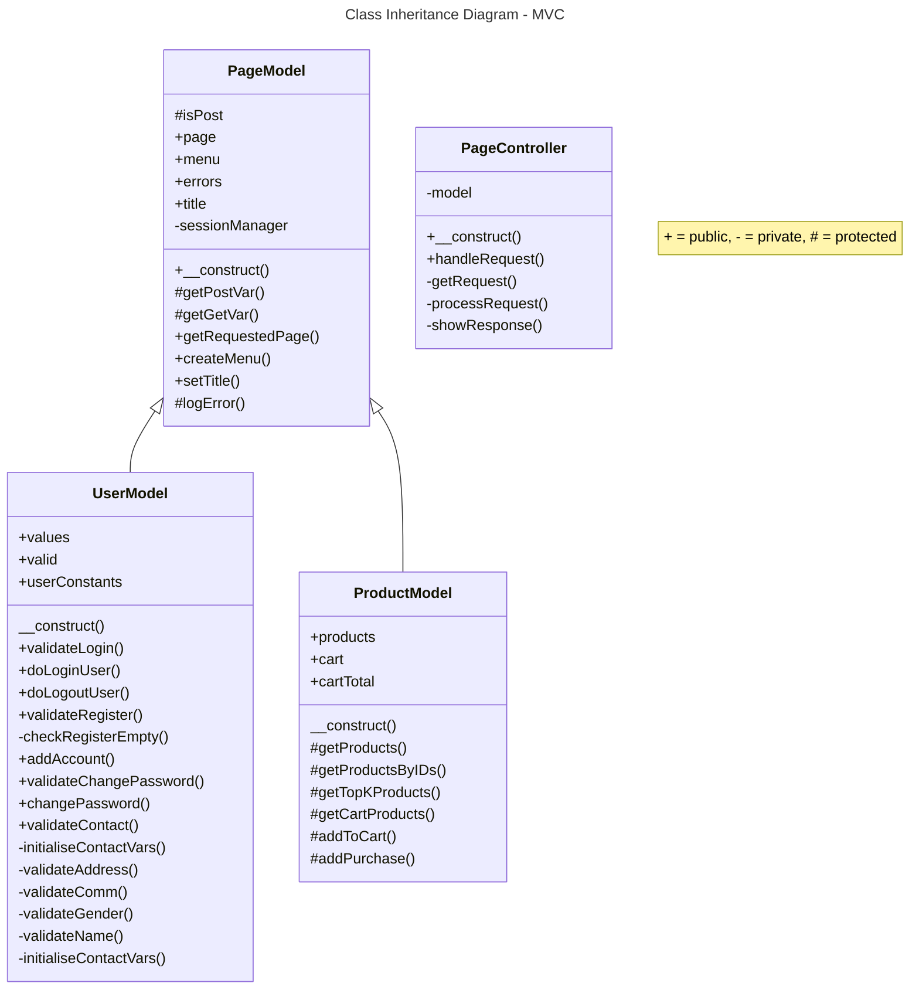

```mermaid
---
title: Class Inheritance Diagram - MVC
---
classDiagram
    note "+ = public, - = private, # = protected"
    %% A <|-- B means that class B inherits from class A %%

    PageModel <|-- UserModel
    PageModel <|-- ProductModel

    class PageController {
        -model
        +__construct()
        +handleRequest()
        -getRequest()
        -processRequest()
        -showResponse()

    }
    class PageModel {
        #isPost
        +page
        +menu
        +errors
        +title
        -sessionManager
        +__construct()
        #getPostVar()
        #getGetVar()
        +getRequestedPage()
        +createMenu()
        +setTitle()
        #logError()
    }

    class UserModel {
        +values
        +valid
        +userConstants
        __construct()
        +validateLogin()
        +doLoginUser()
        +doLogoutUser()
        +validateRegister()
        -checkRegisterEmpty()
        +addAccount()
        +validateChangePassword()
        +changePassword()
        +validateContact()
        -initialiseContactVars()
        -validateAddress()
        -validateComm()
        -validateGender()
        -validateName()
        -initialiseContactVars()
    }

    class ProductModel {
        +products
        +cart
        +cartTotal
        __construct()
        #getProducts()
        #getProductsByIDs()
        #getTopKProducts()
        #getCartProducts()
        #addToCart()
        #addPurchase()
    }

```