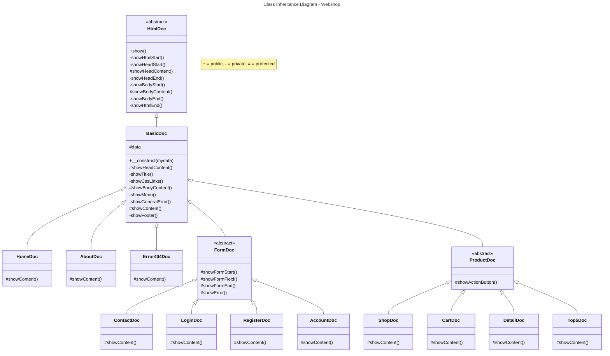

```mermaid
---
title: Class Inheritance Diagram - Webshop
---
classDiagram
    note "+ = public, - = private, # = protected"
    %% A <|-- B means that class B inherits from class A %%
    HtmlDoc <|-- BasicDoc

    BasicDoc <|-- HomeDoc
    BasicDoc <|-- AboutDoc
    BasicDoc <|-- Error404Doc
    BasicDoc <|-- FormDoc
    BasicDoc <|-- ProductDoc

    FormDoc <|-- ContactDoc
    FormDoc <|-- LoginDoc
    FormDoc <|-- RegisterDoc
    FormDoc <|-- AccountDoc

    ProductDoc <|-- ShopDoc
    ProductDoc <|-- CartDoc
    ProductDoc <|-- DetailDoc
    ProductDoc <|-- Top5Doc
    

    class HtmlDoc{
        <<abstract>>
       +show()
       -showHtmlStart()
       -showHeadStart()
       #showHeadContent()
       -showHeadEnd()
       -showBodyStart()
       #showBodyContent()
       -showBodyEnd()
       -showHtmlEnd()
    }
    class BasicDoc{
        #data 
        +__construct(mydata)
        #showHeadContent()
        -showTitle()
        -showCssLinks()
        #showBodyContent()
        -showMenu()
        -showGeneralError()
        #showContent()
        -showFooter()
    }
    class HomeDoc{
        #showContent()
    }
    class AboutDoc{
        #showContent()
    }
    class Error404Doc{
        #showContent()
    }
    class FormDoc{
        <<abstract>>
        #showFormStart()
        #showFormField()
        #showFormEnd()
        #showError()
    }
    class ContactDoc{
        #showContent()
    }
    class LoginDoc{
        #showContent()
    }
    class RegisterDoc{
        #showContent()
    }
    class AccountDoc {
        #showContent()
    }
    class ProductDoc{
        <<abstract>>
        #showActionButton() 
    }
    class ShopDoc{
        #showContent()
    }
    class DetailDoc{
        #showContent()
    }
    class CartDoc{
        #showContent()
    }
    class Top5Doc{
        #showContent()
    }


```
